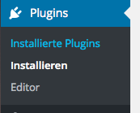

# Podlove Publisher

## Voraussetzungen

* Du hast ein leeres Wordpress
* Du kannst in deinem Wordpress Plugins installieren
* Du hast schon deine erste Episode aufgenommen
* Grundlegende Wordpress Kenntnisse

## Installation der Plugins

Klicke auf "Plugins" und dann auf "Installieren"

Dann trägst du in die Suche `podlove` ein und installierst die folgenden Plugins:

* Podlove Podcast Publisher
* Shownotes
* Podlove Subscribe Button

Bitte nach der Installation die Plugins noch nicht aktivieren sondern einfach
nur auf "Zurück zur Plugin-Installation" klicken.

Wenn du die Installation abgeschlossen hast, klickst du auf "Installierte Plugins"
um dir die installierten Plugins anzeigen zu lassen.

Die Liste der installierten Plugins sollte nun etwa so aussehen:

Hier können wir nun die Plugins aktivieren. Markiere dazu die 3 Plugins mit einem
Haken. Wähle anschließend aus dem Drop-Down Menü `Aktivieren` aus.

Danach klickst du auf `Übernehmen`.

## Einen Podcast anlegen

### Grundeinstellungen

Wir beginnen mit den `Podcast Settings`. Klicke dazu im Podlove Menü auf der
linken Seite auf den Unterpunkt `Podcast Settings`

Unter "Description" trägst du alle wichtigen Daten zu deinem Podcast ein.

Nachdem du alles eingetragen hast, klickst du auf `Änderungen übernehmen`.

### Die Media URL

Unter `Media` trägst du die URL ein, unter der deine Podcasts hochgeladen werden.
Wenn du [Podseed](https://podseed.org/) benutzt, lautet diese `http://cdn.podseed.org/deinpodcast/`
beziehungsweise `https://cdn.podseed.org/deinpodcast` solltest du deine Seite mit HTTPS ausliefern.

Auch hier bestätigst du deine Änderungen mit `Änderungen übernehmen`.

### Lizenz

Unter `License` kannst du nun eine Lizenz für deinen Podcast anlegen.
Die [Creative Commons Webseite](https://creativecommons.org/choose/) kann dir bei
der Auswahl deiner Lizenz helfen.

`Änderungen übernehmen` und weiter gehts!

### Formate hinzufügen

In den `Episode Assets` sind die Formate definiert, in denen deine Podcasts
ausgeliefert werden. Du brauchst mindestens eines davon.

Zum Anlegen eines Formates klickst du auf `Episode Assets` im `Podlove` Menü auf
der linken Seite.

Zum Hinzufügen eines Formates klickst du auf `Add new`

Wähle als "Asset Type" `audio` für ein Audioformat aus. Als "File Format" nimmst du
`MP3 Audio (mp3)`

Speichere nun deine Änderungen mit `Änderungen übernehmen`.

Dieses kannst du anschließend mit allen Audioformaten wiederholen die du deinen
Hörern anbieten willst.

### Feeds hinzufügen

Ganz wichtig: Feeds. Du solltest für jedes Format in dem dein Podcast veröffentlicht
wird einen Feed anbieten.

Damit sind wir am nächsten Menüpunkt des `Podlove` Menüs angelangt: `Podcast Feeds`

Um einen Feed hinzuzufügen klickst du auf `Add new`.

Bei "Episode Media File" wählst du nun dein vorhin angelegtes Format aus, wahrscheinlich
`MP3 Audio`. Als "Feed Name" solltest du auch das Audio Format angeben.

Durch anhaken von "Append Feed Name to Podcast Title" wird automatisch dein Podcast-Name
in den Feed-Titel eingefügt.

Bei "Slug" solltest du den URL Part für den Feed eintragen, meistens reicht `mp3`.

"Discoverable" sorgt dafür, daß der Feed in den Meta-Tags deiner Webseite verlinkt wird.

Durch das Auswählen von "Include HTML Content" werden auch die Shownotes in deinem
Feed sichtbar und können so von Podcast Clients wie [Podcat](http://www.podc.at) angezeigt werden.

Das ganze sollte dann etwa so aussehen:

Wieder die `Änderungen übernehmen` und das ganze für alle in den Assets angelegten Formaten wiederholen.

## Shownotes einbinden

Die [Shownotes](http://shownot.es) erlauben Hörern und Podcastern bei Livesendungen
oder nachträglich Sendungsnotizen mit Zeitstempeln zu erstellen.

### Shownotes Plugin konfigurieren

Zuerst mußt du das Shownotes Plugin konfigurieren. Klicke dazu auf `Einstellungen`
und dann auf `Shownotes`

Dort änderst du den "Tag Mode" auf `use all items except items with the following tags`

Danach speicherst du deine Änderungen mit `Änderungen übernehmen`

### Shownotes in Podlove Template einbinden

Damit die Shownotes auch unter jedem Podcast eingebettet werden, kannst du jetzt
das Standard Podlove Template anpassen.

Dazu klickst du jetzt im `Podlove` Menü auf `Templates`

Im "default" Template fügst du eine neue Zeile mit dem Inhalt `[shownotes]` hinter
dem letzten `` ein. Damit werden jetzt deine Shownotes unter dem Mediaplayer
angezeigt.

**Wichtig**: Jede Änderung in dem Template muß mit dem `Save` Knopf rechts oben
gespeichert werden. Erst danach kann man die Änderungen übernehmen.

Normalerweise werden Mediaplayer, Downloadbuttons und Shownotes über deinem zur
Episode verfassten Text angezeigt. Möchtest du das ändern und deinen Text dem
Mediaplayer voranstellen mußt du die Templateeinbindung so ändern, daß das "default"
Template unten eingefügt wird.

Dazu wählst du bei "Insert at top" `Don't insert automatically`aus und bei
"Insert at bottom" `default`

Wie immer die Änderungen mit `Änderungen übernehmen` übernehmen.
(_Hast du vorher dein Template gespeichert?_)

## Podlove Subscribe Button einbinden

Podlove bietet einen "Abonnieren" Button für verschiedene Clients. Diesen kannst
du komfortabel in der Widgetleiste von Wordpress einbinden.

Klicke hierzu auf "Design" und dann auf das `Widgets` Menü.

Jetzt kannst du den "Podcast Subscribe Button" in die Widget-Leiste ziehen und
einen Stil auswählen.

Nur noch `Speichern` und der Subscribe Button wird in deiner Seitenleiste angezeigt.

## Die erste Episode

Bist du soweit? Dann kannst du jetzt deine erste Episode veröffentlichen.

_Zuerst mußt du deine Mediendateien hochladen._

Klicke auf "Episodes" und dann auf `Add new`.

Du fängst am besten mit dem "Podcast Episode" Feld an. Trage als erstes den Dateinamen
der Episode in das Feld "Episode Media File Slug" ein. Danach sollten die Formate
in den Media Files auftauchen.

Anschließend kannst du die Metadaten der Podcast Episode eintragen.

Ganz unten kannst du die Shownotes im OSF Format einfügen. Das OSF Format wird
[hier](https://github.com/shownotesArchive/OSF-in-a-Nutshell/blob/master/OSF-in-a-Nutshell.de.md)
erklärt.

Jetzt noch den Titel der Episode ergänzen und ein paar einleitende Worte schreiben.

Alles erledigt? Dann kannst du auf `Veröffentlichen` klicken und deine erste
Podcastfolge veröffentlichen.

## Dokumentenlizenz
Dieses Dokument steht unter [Creative Commons BY-NC-SA 4.0](http://creativecommons.org/licenses/by-nc-sa/4.0/)

2016-02-06 Falk Stern <falk@fourecks.de> [https://podseed.org](https://podseed.org)
